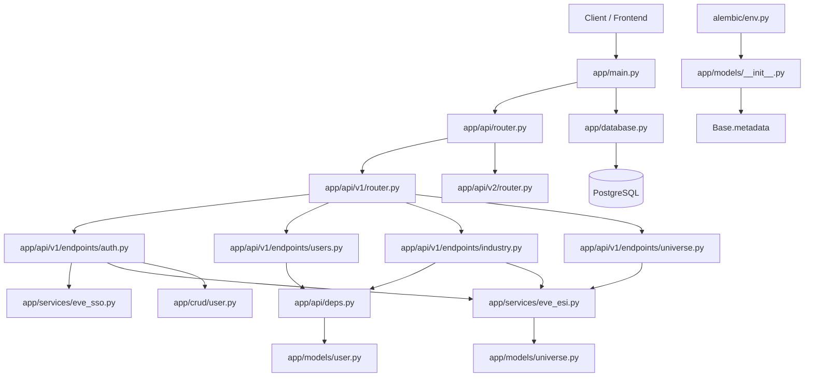

# EVE Server

## 项目结构图

```text
eve-server/
├── .env.development                 # 开发环境变量
├── .env.production                  # 生产环境变量
├── .gitignore                       # Git 忽略规则
├── ALEMBIC_CHECKLIST.md             # Alembic 迁移操作清单
├── alembic.ini                      # Alembic 主配置文件
├── debug_models.py                  # Base.metadata 模型注册诊断脚本
├── readme.md                        # 后端项目说明文档
├── requirements.txt                 # Python 依赖清单
├── alembic/                         # 数据库迁移目录
│   ├── env.py                       # Alembic 运行入口，负责加载模型元数据
│   ├── README                       # Alembic 默认说明文件
│   ├── script.py.mako               # 迁移文件模板
│   └── versions/                    # 历史迁移版本
│       └── 9bf3d1e1abb4_initial_schema.py
└── app/                             # FastAPI 应用主体
    ├── main.py                      # FastAPI 程序入口与路由挂载
    ├── database.py                  # 异步数据库引擎与 Session 工厂
    ├── api/                         # API 路由层
    │   ├── __init__.py              # 导出统一 api_router
    │   ├── router.py                # 聚合所有 API 版本的总入口
    │   ├── deps.py                  # 认证依赖，如当前用户解析
    │   ├── v1/
    │   │   ├── __init__.py          # 导出 v1 api_router
    │   │   ├── router.py            # v1 路由聚合入口
    │   │   ├── endpoints/           # 按业务拆分的接口文件
    │   │   │   ├── __init__.py
    │   │   │   ├── auth.py          # EVE SSO 登录与回调
    │   │   │   ├── industry.py      # 工业任务相关接口
    │   │   │   ├── universe.py      # Universe 名称解析接口
    │   │   │   └── users.py         # 当前用户信息接口
    │   │   └── schemas/             # v1 接口的请求/响应模型
    │   │       ├── __init__.py
    │   │       ├── auth.py
    │   │       ├── industry.py
    │   │       ├── universe.py
    │   │       └── users.py
    │   └── v2/                      # 预留给未来版本升级的占位目录
    │       ├── __init__.py
    │       ├── router.py
    │       ├── endpoints/
    │       │   └── __init__.py
    │       └── schemas/
    │           └── __init__.py
    ├── core/                        # 核心配置与安全能力
    │   ├── config.py                # Pydantic Settings 配置入口
    │   └── security.py              # JWT 签发逻辑
    ├── crud/                        # 数据访问层
    │   ├── __init__.py
    │   └── user.py                  # 用户与角色写库逻辑
    ├── models/                      # SQLAlchemy ORM 模型层
    │   ├── __init__.py              # 聚合所有模型，供 Alembic 扫描
    │   ├── base.py                  # Declarative Base
    │   ├── universe.py              # UniverseName 模型
    │   └── user.py                  # User / Character 模型
    ├── schemas/                     # 预留给跨版本复用的共享 Schema
    ├── services/                    # 外部服务封装层
    │   ├── __init__.py
    │   ├── eve_esi.py               # EVE ESI 查询逻辑
    │   └── eve_sso.py               # EVE SSO 鉴权逻辑
    └── utils/                       # 工具函数目录
```

## 模块关系图



## 目录分析

- `alembic/`: 数据库迁移系统，当前初始迁移已经落在 `versions/9bf3d1e1abb4_initial_schema.py`。
- `app/api/`: 版本化 API 入口层，当前通过 `app/api/router.py` 统一聚合 v1 与预留的 v2 路由。
- `app/api/v1/endpoints/`: 按功能拆分的接口目录，后续新增模块直接在这里落文件。
- `app/api/v1/schemas/`: v1 接口请求/响应模型，Swagger、请求校验和返回结构约束以这里为准。
- `app/api/v2/`: 未来版本占位目录，当前为空实现，但已经接入总路由，后续升级不需要再改动现有 v1 结构。
- `app/core/`: 全局配置与安全逻辑，目前包含环境变量读取和 JWT 签发。
- `app/crud/`: 面向数据库的持久化逻辑，当前主要是 SSO 登录后的用户和角色写入。
- `app/models/`: ORM 模型定义，Alembic 是否能正确生成迁移依赖这里的模型被 `__init__.py` 导入。
- `app/services/`: 对外部系统的封装，当前主要是 EVE SSO 与 ESI，并且通过共享 `aiohttp.ClientSession` 复用外部 HTTP 连接。
- `app/database.py`: 提供异步 SQLAlchemy 引擎与 `get_db()` 依赖。
- `app/schemas/`: 目前保留为空目录，建议未来只放跨版本复用或不直接绑定某个 API 版本的共享 Schema。
- `ALEMBIC_CHECKLIST.md`: 迁移操作手册，后续改表结构时优先参考。

## 服务层说明

## 本地开发启动方式

当前后端支持两种本地开发方式。

### 1. 本机直接运行

适用于你先在宿主机建立 SSH 隧道，再直接运行 Python 服务：

```bash
cd eve-server
source .venv/bin/activate

ssh -p 22222 -N -L 5432:127.0.0.1:5432 ubuntu@43.163.228.205 -i ~/.ssh/NEW_Key.pem
alembic upgrade head
uvicorn app.main:app --reload --host 127.0.0.1 --port 8000
```

这种模式下使用 `.env.development`，数据库地址保持 `localhost:5432`。

### 2. Docker 开发模式

如果后端运行在 Docker 容器内，容器不能再用 `localhost` 访问宿主机 SSH 隧道，而是要通过 `host.docker.internal`。

当前仓库已经提供：

- `.env.docker`：Docker 开发专用环境文件
- `.env.docker.example`：示例模板

启动步骤：

```bash
ssh -p 22222 -N -L 5432:127.0.0.1:5432 ubuntu@43.163.228.205 -i ~/.ssh/NEW_Key.pem
EVE_SERVER_ENV_FILE=./eve-server/.env.docker docker compose up --build
```

`.env.docker` 中的数据库连接串使用的是 `host.docker.internal:5432`，这正是为了访问宿主机上建立的 SSH 隧道。

建议先单独开一个终端保持 SSH 隧道常驻，再在另一个终端执行 Docker 命令；如果 SSH 会话中断，容器内的后端会立即失去数据库连接。

## 当前前后端联通状态

当前后端已经和前端页面完成一轮真实联调，主要包括：

- `GET /api/v1/auth/login`：跳转到 EVE 官方 SSO
- `GET /api/v1/auth/callback`：浏览器场景下完成 JWT 签发后，重定向回前端 `/login/callback`
- `GET /api/v1/users/me`：前端回调落地后读取当前用户状态
- `GET /api/v1/industry/jobs/me`：前端 `Industry` 页面已接入真实数据

这意味着当前后端不再只是 Swagger 可调试状态，而是已经承担真实的浏览器登录回调和前端业务页面数据来源。

如果需要按步骤检查浏览器登录、JWT 落地、用户读取和 Industry 页面数据流，见仓库根目录文档：`API_INTEGRATION_CHECKLIST.md`。

## 当前接口优先级建议

如果继续配合前端推进，后端下一阶段最值得优先补的接口通常是：

1. Dashboard 汇总接口
2. Industry 列表的分页、排序、筛选参数
3. Market 订单或价格查询接口
4. Assets / Characters 相关接口

建议优先做“汇总接口 + 列表分页”这一类前端收益最高的接口，而不是先扩太多零散 endpoint。

## 前端对接重点

当前前端已经依赖这些后端行为：

- 401 时返回统一错误结构
- 浏览器访问 `/api/v1/auth/callback` 时执行前端重定向
- `/api/v1/users/me` 返回稳定字段
- `/api/v1/industry/jobs/me` 返回前端可直接消费的名称扩展字段

后续新增接口时，尽量延续这个风格，避免前端为单个接口写特殊适配逻辑。

## 调试建议

如果前端页面异常但 Swagger 正常，优先按下面顺序排查：

1. 浏览器 Network 中请求是否走到 `/api/v1/...`
2. Docker 或本机代理是否把 `/api` 正确转发到后端
3. 后端是否返回 401 并触发前端登录跳转
4. 接口响应字段是否和前端当前读取字段一致

当前后端有两条外部 HTTP 服务链路：

- `app/services/eve_esi.py`: 负责角色公开档案查询、Universe 名称解析、SDE + 本地缓存 + ESI 回退逻辑。
- `app/services/eve_sso.py`: 负责 SSO Token 换取和 Token 验证。

两者采用统一模式：共享 `aiohttp.ClientSession`、在 `app/main.py` 的 `lifespan` 中执行 `start()` / `close()`，并在生命周期未命中时通过 `get_session()` 兜底创建 session 并记录 warning。这样可以复用外部 HTTP 连接，并避免服务退出时留下未关闭连接池告警。

当前 `User-Agent` 也采用统一命名规范，但按功能区分：

- `WangJianGuo-EVE-ESI/1.0`
- `WangJianGuo-EVE-SSO/1.0`

这样在日志、抓包和平台侧排查时，可以快速区分是 SSO 请求还是 ESI 数据请求。

## Token 刷新策略

EVE 的 `access_token` 有较短有效期，因此不要假设数据库里保存的 token 永远可用。

当前后端已经在业务层提供：

- `app/crud/user.py` 中的 `ensure_character_access_token(...)`
- `app/crud/user.py` 中的 `get_character_with_valid_token(...)`

推荐约定是：

1. 任何未来需要使用角色 `access_token` 访问受保护 ESI 接口的业务逻辑，都先通过这两个 helper 获取角色对象
2. 如果 token 已过期或即将过期，会自动调用 `sso_service.refresh_access_token(...)`
3. 刷新成功后，新的 `access_token`、`refresh_token`、`token_expires` 会自动写回数据库

这可以避免在每个业务接口里重复手写 token 过期判断逻辑。

## Schema 约定

当前接口层采用两条明确约定：

- Request Schema 负责在入口处校验不合法数据，避免把无效参数带进 Service 或数据库层。
- Response Schema 负责把 ESI 的原始字段翻译为更稳定、更适合前端消费的结构。

目前已经落地的点包括：

- `app/api/v1/schemas/universe.py` 中的 `UniverseNamesRequest`：限制 `ids` 必须是 1 到 1000 个正整数。
- `app/api/v1/schemas/industry.py` 中的 `IndustryJobStatus`：把工业任务状态定义为枚举，并补充 `status_label`。
- `app/api/v1/schemas/industry.py` 中的时间字段：例如 `start_date`、`end_date`、`pause_date`、`completed_date` 会在 schema 校验阶段转换为标准时间对象。
- `app/api/v1/endpoints/industry.py` 中的名称扩展字段：`blueprint_name`、`product_name`、`facility_name` 等会在返回前补齐。

## 错误响应约定

当前项目已经统一了 HTTP 异常和参数校验异常的返回结构。

标准错误响应格式：

```json
{
    "error_code": "token_invalid",
    "message": "访问令牌无效，请重新登录"
}
```

参数校验错误格式：

```json
{
    "error_code": "validation_error",
    "message": "请求参数校验失败",
    "details": [
        {
            "field": "query.code",
            "message": "Field required",
            "error_type": "missing"
        }
    ]
}
```

相关代码位置：

- `app/core/errors.py`: 统一创建业务异常
- `app/schemas/common.py`: 统一错误响应模型
- `app/main.py`: 全局 HTTPException / RequestValidationError 异常处理

当前已经使用的常见错误码：

- `token_missing`: 请求没有携带 Bearer Token
- `token_invalid`: Bearer Token 无效或格式错误
- `token_subject_missing`: JWT 中缺少 `sub`
- `user_not_found`: Token 对应的平台用户不存在
- `account_inactive`: 账号已禁用或未激活
- `character_claim_missing`: JWT 中缺少 `character_id`
- `character_not_found`: Token 对应的角色不存在
- `character_token_missing`: 角色缺少可用 ESI access_token
- `validation_error`: 请求参数或请求体校验失败
- `sso_token_invalid`: EVE SSO 授权码或 refresh_token 无效
- `sso_verify_failed`: EVE SSO token 校验失败
- `sso_upstream_failed`: EVE SSO 上游返回异常
- `sso_upstream_unavailable`: EVE SSO 上游暂时不可用
- `esi_upstream_failed`: EVE ESI 上游返回异常或请求失败

推荐约定：

1. 鉴权类错误尽量在 `app/api/deps.py` 统一抛出，不要散落在各个 endpoint 里重复判断。
2. 外部服务错误尽量在 `app/services/` 内转成业务可识别的错误码，不要把原始上游错误文本直接返回给前端。
3. endpoint 层只负责补充当前接口自己的业务错误，例如 `character_token_missing`、`esi_upstream_failed`。

## 开发流程总览

如果你要新增一个功能，建议固定按下面这条链路推进：

1. 先定义“前端最终要什么字段”
2. 再判断这个功能是只查本地数据库，还是需要请求 ESI
3. 如果需要持久化，就先补模型和迁移
4. 再写 CRUD 或 Service
5. 最后写 endpoint 和 schema，把返回格式整理给前端

不要一上来先写 endpoint。这个项目现在已经分层了，最稳的方式是先定数据，再定路由。

## 新功能落地流程

下面以“新增一个业务接口”为例，按从上到下的顺序说明。

### 1. 先确认功能类型

先判断这个功能属于哪一类：

- 只读本地数据库数据
- 需要请求 ESI 但不落库
- 需要请求 ESI 并写入本地数据库
- 需要登录态或角色 token 的受保护接口

这一步决定你后面要动哪些目录。

### 2. 先想清楚前端最终要的响应

你先不要急着写数据库或 endpoint，先写清楚前端最终要拿到什么。

例如：

- 前端到底要原始 ESI 字段，还是要翻译后的业务字段
- 时间字段是原始字符串，还是 `datetime`
- ID 是否要顺手翻译成名称
- 错误时要什么 `error_code`

如果这一步没想清楚，后面很容易在 service、crud、schema 里反复返工。

### 3. 定义 Schema

先写 schema，再写 endpoint。

文件落点：

- 新增接口请求/响应模型：`app/api/v1/schemas/<module>.py`
- 跨版本通用模型：`app/schemas/`

建议：

1. 请求参数写成 Request Schema 或 Query Schema
2. 返回值写成 Response Schema
3. 给字段补 `description`、`examples`
4. GET 查询参数优先用 `Annotated[..., Query()]`

例子：

- `app/api/v1/schemas/universe.py`
- `app/api/v1/schemas/industry.py`
- `app/api/v1/schemas/auth.py`

### 4. 如果要落库，先改 Model

只要这个功能需要新增表、字段、索引、外键，就先改 ORM 模型。

文件落点：

- 新模型文件：`app/models/<module>.py`
- 模型聚合导出：`app/models/__init__.py`

规则：

1. 新模型必须在 `app/models/__init__.py` 里导入，不然 Alembic 扫不到
2. 公共字段命名要和当前项目风格一致
3. 时间字段尽量使用 timezone-aware `DateTime(timezone=True)`

### 5. 生成数据库迁移

改完模型后，马上生成 Alembic 迁移，不要等到后面一起补。

常用命令：

```bash
/Users/wangjianguo/Desktop/EVE/eve_client/eve-server/.venv/bin/alembic revision --autogenerate -m "your_change"
/Users/wangjianguo/Desktop/EVE/eve_client/eve-server/.venv/bin/alembic upgrade head
```

文件落点：

- 迁移文件：`alembic/versions/*.py`

如果涉及建表、加索引、改字段类型，优先先看 `ALEMBIC_CHECKLIST.md`。

### 6. 写 Service 还是写 CRUD

这是现在最容易乱的地方，可以按下面规则区分：

放到 `app/services/` 的逻辑：

- 请求 EVE SSO
- 请求 EVE ESI
- 名称解析
- 外部 API 适配
- token 刷新

放到 `app/crud/` 的逻辑：

- 查数据库
- 写数据库
- Upsert
- 聚合数据库内的业务读写逻辑

简单判断：

- 只要碰外部 HTTP，优先放 `services/`
- 只要碰数据库持久化，优先放 `crud/`
- 如果既要请求外部 API 又要写库，通常是 endpoint 调 service，再调 crud

当前参考文件：

- `app/services/eve_esi.py`
- `app/services/eve_sso.py`
- `app/crud/user.py`

### 7. 写 Endpoint

当前 v1 接口文件统一放在：

- `app/api/v1/endpoints/auth.py`
- `app/api/v1/endpoints/users.py`
- `app/api/v1/endpoints/universe.py`
- `app/api/v1/endpoints/industry.py`

如果你要新增一个新模块，例如 market、assets、characters，建议直接创建：

- `app/api/v1/endpoints/market.py`
- `app/api/v1/schemas/market.py`

然后在以下位置接线：

- `app/api/v1/endpoints/__init__.py`
- `app/api/v1/schemas/__init__.py`
- `app/api/v1/router.py`

endpoint 层建议只做这几件事：

1. 收请求参数
2. 调依赖拿当前用户/当前角色
3. 调 service 或 crud
4. 做少量组装
5. 返回 response schema

不要把大量数据库逻辑和外部 HTTP 逻辑都塞在 endpoint 里。

### 8. 如果需要登录态或角色 Token

当前项目已经有现成依赖，不要重复造轮子。

可直接复用：

- `app/api/deps.py` 中的 `get_current_user`
- `app/api/deps.py` 中的 `get_current_character`

如果接口需要访问受保护 ESI：

1. 优先拿 `current_character`
2. 它内部会走 token 校验和刷新链路
3. 再把 `current_character.access_token` 传给 service

不要在每个 endpoint 里手写 refresh token 逻辑。

### 9. 如果需要把 ESI 数据写回数据库

推荐顺序：

1. endpoint 调 service 请求 ESI
2. service 返回标准化数据
3. endpoint 或上层业务逻辑调用 crud 写库
4. 最后再返回给前端 response schema

如果你直接在 service 里顺手写库，后面会越来越难拆和测试。

### 10. 如何判断该在哪个文件夹新建文件

最简单的速查表：

- 新接口路由：`app/api/v1/endpoints/`
- 新接口请求/响应模型：`app/api/v1/schemas/`
- 通用错误模型、共享 schema：`app/schemas/`
- 外部 HTTP 对接：`app/services/`
- 数据库读写：`app/crud/`
- ORM 表结构：`app/models/`
- 数据库迁移：`alembic/versions/`
- 全局配置：`app/core/`

### 11. 新增一个完整功能时的最小 Checklist

你以后可以直接照这个顺序走：

1. 在 `app/api/v1/schemas/<module>.py` 写请求和响应模型
2. 如果要落库，在 `app/models/<module>.py` 写模型
3. 在 `app/models/__init__.py` 注册模型
4. 生成 Alembic migration 并升级数据库
5. 在 `app/services/<module>.py` 或已有 service 中补外部 API 逻辑
6. 在 `app/crud/<module>.py` 写数据库读写逻辑
7. 在 `app/api/v1/endpoints/<module>.py` 写接口
8. 在 `app/api/v1/endpoints/__init__.py` 和 `app/api/v1/router.py` 注册路由
9. 在 `app/api/v1/schemas/__init__.py` 导出 schema
10. 打开 `/docs` 检查 Swagger
11. 联调请求，确认成功响应和错误响应都符合 schema

### 12. 一个具体例子：新增市场订单接口

假设你要加“当前角色市场订单”接口，可以按下面落地：

1. 先建 `app/api/v1/schemas/market.py`
2. 定义 `MarketOrdersQueryParams` 和 `MarketOrdersResponse`
3. 如果只是读 ESI，不落库，可以不改 model
4. 在 `app/services/eve_esi.py` 新增 `get_character_market_orders(...)`
5. 在 `app/api/v1/endpoints/market.py` 写 `GET /api/v1/market/orders/me`
6. 用 `get_current_character` 拿当前角色和 token
7. 如果订单里有 type_id、location_id，就继续复用 `resolve_ids(...)` 做名称翻译
8. 在 `app/api/v1/endpoints/__init__.py` 和 `app/api/v1/router.py` 注册 `market_router`
9. 打开 `/docs` 检查字段说明

如果这个接口还要把市场订单缓存到本地数据库，再额外补：

1. `app/models/market.py`
2. `app/crud/market.py`
3. Alembic migration

## 开发指南 (Development Guide)

### 0. 开发前置条件

开始前请先确认以下条件满足：

- 已安装 Python 3.12 左右版本
- 本地或远程 PostgreSQL 可连接
- `eve-server/.env.development` 已正确配置
- 如果数据库通过 SSH 隧道暴露到本机，请确认 `localhost:5432` 已监听
- EVE SSO 相关环境变量已正确配置，例如 `ESI_CLIENT_ID`、`CLIENT_SECRET`、`ESI_CALLBACK_URL`

### 1. 创建并激活虚拟环境 (venv)

首次拉起项目时：

```bash
cd eve-server
python3 -m venv .venv
source .venv/bin/activate
```

之后日常开发只需要：

```bash
cd eve-server
source .venv/bin/activate
```

> **提示**：激活成功后，你的终端命令行最前面会出现 `(.venv)` 字样。如果你想退出虚拟环境，可以直接运行命令 `deactivate`。

### 2. 安装依赖

```bash
pip install -r requirements.txt
```

### 3. 初始化数据库结构

第一次运行项目，或者模型结构刚刚发生变化时，先执行数据库迁移：

```bash
/Users/wangjianguo/Desktop/EVE/eve_client/eve-server/.venv/bin/alembic upgrade head
```

迁移相关的详细规范和排障说明见 `eve-server/ALEMBIC_CHECKLIST.md`。

### 4. 启动前检查

启动 FastAPI 前建议先确认：

1. `eve-server/.env.development` 中的 `DATABASE_URL` 正确
2. 数据库端口可连，例如 `localhost:5432`
3. 虚拟环境 `.venv` 已激活
4. Alembic 迁移已执行到最新版本

可选检查命令：

```bash
lsof -iTCP:5432 -sTCP:LISTEN
/Users/wangjianguo/Desktop/EVE/eve_client/eve-server/.venv/bin/alembic current
```

### 5. 启动本地服务

在已激活虚拟环境的状态下，指定对应的环境变量文件（如 `.env.development`）并启动 FastAPI：

```bash
export PYTHONPATH=.
dotenv -f .env.development run -- uvicorn app.main:app --reload --port 8000
```

启动后，FastAPI 会在 `lifespan` 中自动初始化 `eve_esi.py` 和 `eve_sso.py` 的共享 HTTP session。

如果服务正常启动，你可以进一步验证：

```bash
curl http://127.0.0.1:8000/health
```

如果项目启用了文档页面，也可以直接访问：

```text
http://127.0.0.1:8000/docs
```

### 6. 常用开发命令

```bash
/Users/wangjianguo/Desktop/EVE/eve_client/eve-server/.venv/bin/alembic current
/Users/wangjianguo/Desktop/EVE/eve_client/eve-server/.venv/bin/alembic history
/Users/wangjianguo/Desktop/EVE/eve_client/eve-server/.venv/bin/alembic revision --autogenerate -m "your_change"
/Users/wangjianguo/Desktop/EVE/eve_client/eve-server/.venv/bin/alembic upgrade head
```

### 7. 推荐开发顺序

建议按以下顺序开展本地开发：

1. 激活 `.venv`
2. 安装依赖
3. 检查 `.env.development`
4. 确认数据库连通
5. 执行 `alembic upgrade head`
6. 启动 `uvicorn`
7. 再进行接口调试与联调

### 8. 关键入口文件

如果你第一次接手这个后端，建议按这个顺序阅读：

1. `app/main.py`: 看应用启动方式、统一路由挂载和 lifespan 生命周期
2. `app/core/config.py`: 看环境变量和配置来源
3. `app/database.py`: 看数据库引擎和 Session
4. `app/api/router.py`: 看总路由如何统一聚合 v1 和 v2
5. `app/api/v1/router.py`: 看 v1 路由如何统一聚合
6. `app/api/v1/endpoints/`: 看各业务模块对应的接口实现
7. `app/api/v1/schemas/`: 看接口输入输出的数据结构定义
8. `app/services/eve_sso.py`: 看 SSO 鉴权链路
9. `app/services/eve_esi.py`: 看外部 ESI 请求、缓存和名称解析逻辑
10. `app/crud/user.py`: 看角色 token 持久化和 refresh helper
11. `app/models/__init__.py`: 看 Alembic 扫描依赖的模型聚合入口
12. `alembic/env.py`: 看迁移环境如何加载元数据
